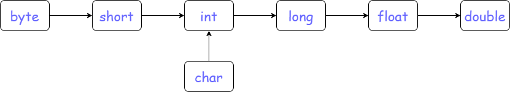

# 类型转换

变量转换智能在同类对象才能互相转换，例如数值类智能转换成数值类。

下面介绍数值类型转换。

## 强制类型转换

`double` -> `float` -> `long` -> `int` -> `char` -> `short` -> `byte`

存在内存溢出和精度问题

```java
// 强制类型转换：(Low-level type) High-level indentifier | High-level literal | High-level expression

// 内存溢出
byte b = (byte) 128; // int -> byte
System.out.println(b); // -128

// 精度问题
int i = (int) 3.14; // double -> int
System.out.println(i); // 3
```

## 自动转换

### 赋值运算中的自动类型转换



原则：整型向浮点自动转换，低位向高位自动转换。

```java
byte a = 8;
short b = 16;
char c = 16;
int d = 32;
long e = 64;
float f = 32.0f;
double g = 64.0;

b = a; // byte -> short   低位转高位
d = b; // short -> int    低位转高位
d = c; // char -> int     低位转高位
e = d; // int -> long     低位转高位
f = e; // long -> float   整型转浮点
g = f; // float -> double 低位转高位

// 例外
c = a; // byte -> char    无法转换
b = c; // char -> short   无法转换
c = b; // short -> char   无法转换
```

### 数值运算中的自动类型转换

1. 如操作数之一为`double`，则另一个操作数先被转化为`double`，再参与算术运算。
2. 如两操作数均不为`double`，当操作数之一为`float`，则另一操作数先被转换为`float`，再参与运算。
3. 如两操作数均不为`double`或`float`，当操作数之一为`long`，则另一操作数先被转换为`long`，再参与算术运算。
4. 如两操作数均不为`double`、`float`或`long`，则两操作数先被转换为int，再参与运算。

```java
public class Test {
    public static void main(String[] args) {
        short a = 1;
        byte b = 2;
        char c = 3;

        // 三个输出都是 class java.lang.Integer
        System.out.println(getType(b + a));

        System.out.println(getType(b + c));

        System.out.println(getType(a + c));
    }

    public static String getType(Object o) {
        return o.getClass().toString();
    }
}
```

## References

1. [Java Type Casting](https://www.w3schools.com/java/java_type_casting.asp)
2. [java基本数据类型自动转换规则](https://blog.csdn.net/qq_18433441/article/details/76602614)
