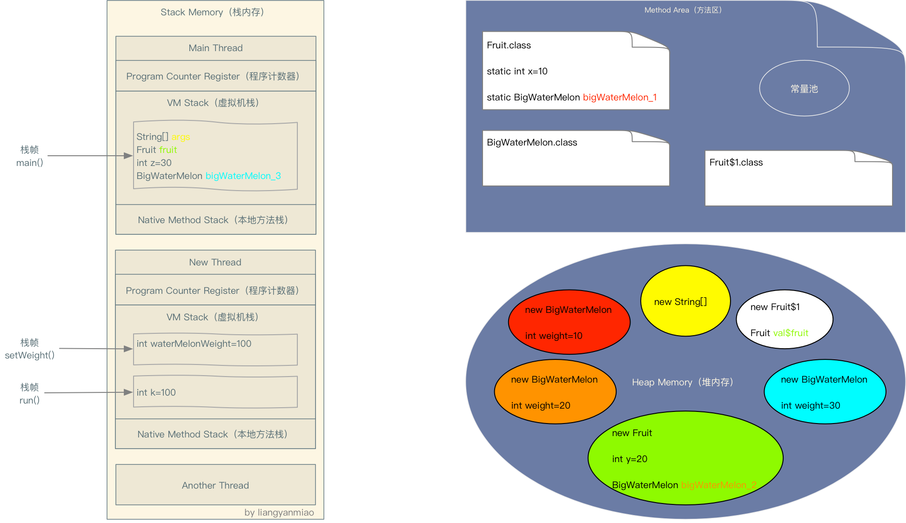

# 变量与常量

## 变量

变量指代内存中的一块位置和大小确定的空间。该内存空间可以用一个标识符来标识，该标识符就是变量的变量名；该内存空间存储的数据是可以变化的，存储的数据就是变量的值。

Java是一种强类型语言，每个变量都必须声明其类型。类型可以是基本类型，也可以是引用类型。

变量定义

```java
type identifier [ = value][, identifier [= value] ...] ;
```

## 变量作用域

### 类变量

类里面，方法外面，加`static`。
从属于类。

### 实例变量

类里面，方法外面，没有`static`。
从属于对象。
如果不进行初始化，会是该类型的默认值。

### 局部变量

在方法里面
必须声明和初始化
神明周期从变量声明到语句块结束

# 常量（Constant）

常量（Constant）：初始化（initialize）后不能再改变值！不会变动的值。

所谓常量可以理解成一种特殊的变量，它的值被设定后，在程序运行过程中不允许被改变。

常量名一般大写

常量定义

```java
final type identifier [ = value][, identifier [= value] ...] ;
```

修饰符如`static`，`final`，`public`等修饰词不分先后顺序

# 变量命名规范

- 变量要做到见名知意
- 类名：首字母大写+驼峰原则
- 局部变量，类成员变量，方法名：首字母小写+驼峰原则
- 常量：大写字母+下划线

# References

1. [Java中的对象类型像引用还是指针，谁是谁非？](https://blog.csdn.net/oracle_microsoft/article/details/83137717)
2. [2](https://blog.csdn.net/Endeavor_G/article/details/104570145)
3. [3](https://blog.csdn.net/Mint6/article/details/100006266)
4. [4](https://blog.csdn.net/leunging/article/details/80599282)
5. [5](https://blog.csdn.net/zhangliangzi/article/details/50374954)
6. [6](https://blog.csdn.net/a916879788/article/details/72758656)
7. [7](https://juejin.im/post/5bce68226fb9a05ce46a0476)

> **栈(stack)**：是简单的数据结构，但在计算机中使用广泛。栈最显著的特征是：LIFO(Last In, First Out,后进先出)。比如我们往箱子里面放衣服，先放入的在最下方，只有拿出后来放入的才能拿到下方的衣服。栈中只存放基本类型和对象的引用(不是对象)。
>
> **堆(heap)**：堆内存用于存放由new创建的对象和数组。在堆中分配的内存，由java虚拟机自动垃圾回收器来管理。JVM只有一个堆区(heap)被所有线程共享，堆中不存放基本类型和对象引用，只存放对象本身。
>
> **方法区(method)**：又叫静态区，跟堆一样，被所有的线程共享。方法区包含所有的class和static变量。

**变量**是在内存中分配的保留区域的名称。换句话说，它是一个内存位置的名称，也就是说我们通过这个变量名字就可以找到一个指向这个变量所引用的数据的内存指针，根据变量的类型我们可以知道这个指针之后的几个字节里存储了这个变量所引用的数据。要了解变量在内存中的分配要了解两部分内容，一个是“变量在内存中的分配”，另一个是“变量所引用的数据在内存中的分配”。以下简称为“变量分配”与“数据分配”。

变量按数据类型分类可以分为**基本数据类型**和**引用数据类型**。

变量按作用域分类又可以分为**类变量**、**实例变量**和**局部变量**。

1. 局部变量
    - 基本数据类型——变量分配：栈，数据分配：栈
    - 引用数据类型——变量分配：栈，数据分类：堆
2. 实例变量
    - 基本数据类型——变量分配：堆，数据分配：堆
    - 引用数据类型——变量分配：堆，数据分配：堆
3. 类变量
    - 基本数据类型——变量分配：方法区，数据分配：方法区
    - 引用数据类型——变量分配：方法区，数据分配：堆

```java
class Fruit {
    static int x = 10;
    static BigWaterMelon bigWaterMelon_1 = new BigWaterMelon(x);

    int y = 20;
    BigWaterMelon bigWaterMelon_2 = new BigWaterMelon(y);

    public static void main(String[] args) {
        final Fruit fruit = new Fruit();

        int z = 30;
        BigWaterMelon bigWaterMelon_3 = new BigWaterMelon(z);

        new Thread() {
            @Override
            public void run() {
                int k = 100;
                setWeight(k);
            }

            void setWeight(int waterMelonWeight) {
                fruit.bigWaterMelon_2.weight = waterMelonWeight;
            }
        }.start();
    }
}

class BigWaterMelon {
    public BigWaterMelon(int weight) {
        this.weight = weight;
    }

    public int weight;
}
```




## Java中的引用和C++中的指针

C++的对象类型分为三种：`对象变量`，`对象指针`和`对象引用`（这里特指是C++的引用）。`对象变量`，与基本数据类型变量一样，分配在栈中，对象在栈的生命空间结束后，系统会自动释放对象所占用的空间；`对象指针`，与C语言中的指针一样，都是一个地址，它指向栈中或堆中的一个对象。`对象引用`是C++中与C不同之外，形象地说，引用就是一个别名，定义引用的时候必须一起初始化，不能引用不存在的对象。

下面是C++中定义三种对象类型的代码：

```c++
String a("string a");

String *pA = &a;

String *pB = new String("string b");

String &c = a;
```

- 语句1中定义一个`String`变量`a`，它的内容是`"string a"`；
- 语句2中定义一个`String`对象指针`pA`，它指向对象`a`(栈对象)；
- 语句3中定义一个`String`对象指针`pB`，不过它指向一个分配在堆中的对象;
- 语句4是定义一个`String`对象引用`c`，它引用`a`，也即是说`c`是`a`的别名，即同一个变量，两个不同的名字而已。只要改变`a`或`c`，该变量内容都会发生改变的。

Java中的对象类型只有一种，那就是引用（注意是Java的引用，而非C++的引用）。下面是定义一个引用的代码。

```java
String s = new String("string");
```

上面的语句中其实做了两件事情，在堆中创建了一个`String`对象，内容为`"string"`，在栈中创建了一个引用`s`，它指向堆中刚创建好的`String`对象。并且引用`s`值的改变不影响它所指的对象，只有通过它调用对象的方法对可能改变对象的内容。

```java
s = new String("abc");
```

在上面这个语句中，只改变`s`的值，因此不会对内容为`"string"`对象造成影响（不考虑垃圾回收情况）。只不过是`s`指向堆中的新对象而已，从指针上来说，就是`s`的值改变了而已。

从上面来看，Java的引用，并不与C++的引用相同，因此它不是一个别名；与对象变量也不同，它只是表示一个内存位置，该位置就是存在一个对象的位置，而不是真实的对象变量。并且从指针的意义角度来说，C/C++的指针与Java的引用却是不谋而合。它们都表是一个内存地址，都可以通过这个内存地址来操纵它所对应的对象。因此Java的引用更像C++中的指针，在下文中把它称为Java中的指针，同样也可称为Java中的引用。

在C++的对象指针里面，出现的指针运算符主要有以下几个：`*`，`->`。

运算符`*`是返回指针所指向的对象，而`->`是返回指针所指向对象的数据成员或方法成员。由于Java不存在对象变量，而是通过指针来访问对象的，因此Java中不需要提供`*`运算符，这是Java优化了C++的一个指针问题。对于`->`运行符，Java的指针是提供的，不过是采用`.`运算符的方式提供，看起来与C++中对象变量的`.`运算符一样，其实意义是有不一样的地方。