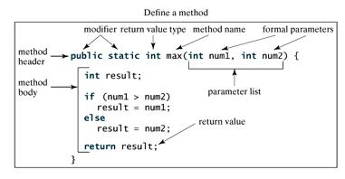

# 方法

`System.out.println()`是什么？

- `println()` 是一个方法。
- `System` 是系统类。
- `out` 是标准输出对象。

这句话的用法是调用系统类 `System` 中的标准输出对象 `out` 中的方法 `println()`。

## 什么是方法？

Java方法是语句的集合，它们在一起执行一个功能。

- 方法是解决一类问题的步骤的有序组合
- 方法包含于类或对象中
- 方法在程序中被创建，在其他地方被引用

方法的本意是功能块，就是实现某个功能的语句块的集合。设计方法的时候，最好保证方法的**原子性**，即一个方法只是先一个功能。

## 方法的优点

1. 使程序变得更简短而清晰。
2. 有利于程序维护。
3. 可以提高程序开发的效率。
4. 提高了代码的重用性。

## 方法的命名规则

1. 方法的名字的第一个单词应以小写字母作为开头，后面的单词则用大写字母开头写，不使用连接符。例如：`addPerson`。
2. 下划线可能出现在 `JUnit` 测试方法名称中用以分隔名称的逻辑组件。一个典型的模式是：`test<MethodUnderTest>_<state>`，例如 `testPop_emptyStack`。

## 方法的定义

一般情况下，定义一个方法包含以下语法：

```java
修饰符 返回值类型 方法名(参数类型 参数名){
    ...
    方法体
    ...
    return 返回值;
}
```

方法包含一个**方法头**和一个**方法体**。下面是一个方法的所有部分：

- **修饰符**：修饰符，这是可选的，告诉编译器如何调用该方法。定义了该方法的访问类型。
- **返回值类型**：方法可能会返回值。`returnValueType` 是方法返回值的数据类型。有些方法执行所需的操作，但没有返回值。在这种情况下，`returnValueType` 是关键字`void`。
- **方法名**：是方法的实际名称。方法名和参数表共同构成方法签名。
- **参数类型**：*形式参数* 像是一个占位符。当方法被调用时，传递值给形式参数。这个值被称为 *实参* 或 *变量* 。*参数列表* 是指方法的参数类型、顺序和参数的个数。参数是可选的，方法可以不包含任何参数。
- **方法体**：方法体包含具体的语句，定义该方法的功能。



> 注意：在一些其它语言中方法指过程和函数。一个返回非void类型返回值的方法称为函数；一个返回void类型返回值的方法叫做过程。

## 方法调用

### 方法调用语法

```java
对象名.方法名(实参列表)
```

Java 支持两种调用方法的方式，根据方法是否返回值来选择。

当程序调用一个方法时，程序的控制权交给了被调用的方法。当被调用方法的返回语句执行或者到达方法体闭括号时候交还控制权给程序。

当方法返回一个值的时候，方法调用通常被当做一个值。例如：

```java
int larger = max(30, 40);
```

如果方法返回值是void，方法调用一定是一条语句。例如，方法println返回void。下面的调用是个语句：

```java
System.out.println("Hello, World！");
```

> `main` 方法是被 JVM 调用的，除此之外，`main` 方法和其它方法没什么区别。
>
> `main` 方法的头部是不变的，如例子所示，带修饰符 `public` 和 `static`,返回 `void` 类型值，方法名字是 `main`,此外带个一个 `String[]` 类型参数。`String[]` 表明参数是字符串数组。

### 静态方法无法调用非静态方法

非静态方法可以调用静态方法和非静态方法，而静态方法只能调用静态方法。

首先 `static` 的成员是在类加载的时候初始化的，JVM的 `CLASSLOADER` 的加载，首次主动使用加载，而非 `static` 的成员是在创建对象的时候，即 `new` 操作的时候才初始化的；

先后顺序是先加载，才能初始化，那么加载的时候初始化 `static` 的成员，此时非 `static` 的成员还没有被加载必然不能使用，而非 `static`的成员是在类加载之后，通过 `new` 操作符创建对象的时候初始化，此时`static` 已经分配内存空间，所以可以访问！

简单点说：静态成员属于类,不需要生成对象就存在了，而非静态需要生成对象才产生，所以静态成员不能直接访问非静态。

## 通过值传递参数

> **值传递**：在方法被调用时，实参通过形参把它的内容副本传入方法内部，此时形参接收到的内容是实参值的一个拷贝，因此在方法内对形参的任何操作，都仅仅是对这个副本的操作，不影响原始值的内容。
>
> **引用传递**：“引用”也就是指向真实内容的地址值，在方法调用时，实参的地址通过方法调用被传递给相应的形参，在方法体内，形参和实参指向通愉快内存地址，对形参的操作会影响的真实内容。

Java 中都是通过值传递来传递参数的，点击[这里](https://juejin.im/post/5bce68226fb9a05ce46a0476)了解详情。

## 重载（Overload）

重载(overloading) 是在一个类里面，方法名字相同，而参数不同。返回类型可以相同也可以不同。

每个重载的方法（或者构造函数）都必须有一个独一无二的参数类型列表。

最常用的地方就是构造器的重载。

**重载规则**:

- 被重载的方法必须改变参数列表(参数个数或类型不一样)；
- 被重载的方法可以改变返回类型；
- 被重载的方法可以改变访问修饰符；
- 被重载的方法可以声明新的或更广的检查异常；
- 方法能够在同一个类中或者在一个子类中被重载。
- 无法以返回值类型作为重载函数的区分标准。

## 命令行传参

有时候你希望运行一个程序时候再传递给它消息。这要靠传递命令行参数给`main()`函数实现。

命令行参数是在执行程序时候紧跟在程序名字后面的信息。

```java
public class CommandLine {

    public static void main(String[] args) {
        for (int i = 0; i < args.length; i++) {
            System.out.println("args[" + i + "]: " + args[i]);
        }
    }
}
```

结果如下

```bash
$ javac CommandLine.java
$ java CommandLine this is a command line 200 -100
args[0]: this
args[1]: is
args[2]: a
args[3]: command
args[4]: line
args[5]: 200
args[6]: -100
```

## 可变参数

JDK 1.5 开始，Java支持传递同类型的可变参数给一个方法。

方法的可变参数的声明如下所示：

```java
typeName... parameterName
```

在方法声明中，在指定参数类型后加一个省略号(`...`) 。

一个方法中只能指定一个可变参数，它必须是方法的最后一个参数。任何普通的参数必须在它之前声明。

```java
public class VarargsDemo {
    public static void main(String args[]) {
        // 调用可变参数的方法
        printMax(34, 3, 3, 2, 56.5);
        // The max value is 56.5

        // 可变参数本身就是传递数组
        printMax(new double[]{1, 2, 3});
        // The max value is 3.0
    }

    public static void printMax( double... numbers) {
        if (numbers.length == 0) {
            System.out.println("No argument passed");
            return;
        }

        double result = numbers[0];

        for (int i = 1; i <  numbers.length; i++){
            if (numbers[i] >  result) {
                result = numbers[i];
            }
        }
        System.out.println("The max value is " + result);
    }
}
```

## 参考文献

1. [Java 方法 - 菜鸟教程](https://www.runoob.com/java/java-methods.html)
2. [这一次，彻底解决Java的值传递和引用传递](https://juejin.im/post/5bce68226fb9a05ce46a0476)
3. [Java 重写(Override)与重载(Overload) - 菜鸟教程](https://www.runoob.com/java/java-override-overload.html)
4. [java中静态方法中调用非静态方法](https://blog.csdn.net/u010147215/java/article/details/51346378)