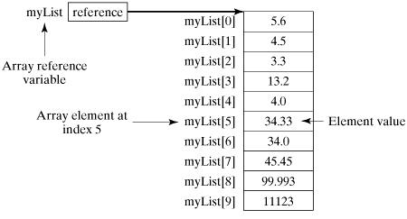

# 数组

数组是**相同类型**数据的**有序**集合。其中，每个数据称作一个数组元素，每个数组元素可以通过一个下标来访问。

## 数组声明

首先必须声明数组变量，才能在程序中使用数组。下面是声明数组变量的语法：

```java
dataType[] arrayRefVar; // 首选的方法

dataType arrayRefVar[]; // 效果相同，但不是首选方法
```

> 注意: 建议使用 dataType[] arrayRefVar 的声明风格声明数组变量。 dataType arrayRefVar[] 风格是来自 C/C++ 语言 ，在Java中采用是为了让 C/C++ 程序员能够快速理解java语言。

## 数组创建

Java语言使用`new`操作符来创建数组，语法如下：

```java
arrayRefVar = new dataType[arraySize];
```

上面的语法语句做了两件事：

1. 使用 `dataType[arraySize]` 创建了一个数组。
2. 把新创建的数组的引用赋值给变量 `arrayRefVar`。

数组变量的声明，和创建数组可以用一条语句完成，如下所示：

```java
dataType[] arrayRefVar = new dataType[arraySize];
```

另外，你还可以使用如下的方式创建数组。

```java
dataType[] arrayRefVar = {value0, value1, ..., valuek};
```

数组的元素是通过索引访问的。数组索引从 `0` 开始，所以索引值从 `0` 到 `arrayRefVar.length-1`。

## 实例

下面的语句首先声明了一个数组变量 `myList`，这个数组变量是存放在栈中的；接着创建了一个包含 10 个 `double` 类型元素的数组对象，数组对象是存放在堆中的；最后把它的引用赋值给 `myList` 变量。

有关栈和堆的知识，可以回顾 Java/基础/变量 一节。

```java
public class TestArray {
   public static void main(String[] args) {
      // 数组大小
      int size = 10;
      // 定义数组
      double[] myList = new double[size];
      myList[0] = 5.6;
      myList[1] = 4.5;
      myList[2] = 3.3;
      myList[3] = 13.2;
      myList[4] = 4.0;
      myList[5] = 34.33;
      myList[6] = 34.0;
      myList[7] = 45.45;
      myList[8] = 99.993;
      myList[9] = 11123;
      // 计算所有元素的总和
      double total = 0;
      for (int i = 0; i < size; i++) {
         total += myList[i];
      }
      System.out.println("总和为： " + total); // 总和为： 11367.373
   }
}
```

下面的图片描绘了数组 `myList`。这里 `myList` 数组里有10个 `double` 元素，它的下标从 `0` 到 `9`。



## 数组初始化

### 静态初始化

```java
int[] a = {1, 2, 3};
Man[] mans = {new Man(1, 1), new Man(1, 1)};
```

### 动态初始化

```java
int[] a = new int[2];
a[0] = 1;
a[1] = 2;
```

### 数组的默认初始化

数组也是应用类型，它的元素相当于类的实例变量，因此数组一经分配空间，其中的每个元素也被按照实例变量同样的方式被隐式初始化。

## 数组的四个基本特点

- 数组的长度是确定的。数组一旦被创建，它的大小就是不可以改变的。
- 数组元素必须是相同类型，不允许出现混合类型。
- 数组中的元素可以是任何数据类型，包括基本类型和引用类型。
- 数组变量属于引用类型，存放在栈中。
- 数组本身就是对象，Java中对象是在堆中的，因此数组无论保存原始类型还是其他对象类型，数组中的每个元素都相当于该对象的成员变量。

## For-Each 循环

JDK 1.5 引进了一种新的循环类型，被称为 For-Each 循环或者加强型循环，它能在不使用下标的情况下遍历数组。

语法格式如下：

```java
for(type element: array)
{
    System.out.println(element);
}
```

## 多维数组

多维数组可以看成是数组的数组，比如二维数组就是一个特殊的一维数组，其每一个元素都是一个一维数组。

所谓数组的初始化

```java
// 静态初始化
int a[][] = new int[2][3];
int b[][] = { { 1, 2, 3 }, { 4, 5, 6 } };

// 动态初始化
String s[][] = new String[2][];
s[0] = new String[2];
s[1] = new String[3];
s[0][0] = new String("Good");
s[0][1] = new String("Luck");
s[1][0] = new String("to");
s[1][1] = new String("you");
s[1][2] = new String("!");
```

## Arrays 类

`java.util.Arrays` 类能方便地操作数组，它提供的所有方法都是静态的。详情查看[这里](https://docs.oracle.com/en/java/javase/14/docs/api/java.base/java/util/Arrays.html)。

## 冒泡排序

```java
static void bubbleSort(int[] array) {
   for (int i = 0; i < array.length - 1; i++) {
      // 完成标记
      boolean ok = true;
      for (int j = array.length - 1; j > i; j--) {
         if (array[j] < array[j - 1]) {
            int tmp = array[j];
            array[j] = array[j - 1];
            array[j - 1] = tmp;
            // 数组元素发生过置换，说明未完成
            ok = false;
         }
      }
      // 一次遍历过程中发现没有置换，则说明排序完成
      if (ok) {
         break;
      }
   }
}
```

## 参考文献

1. [Java 数组 - 菜鸟教程](https://www.runoob.com/java/java-array.html)
2. [Class Arrays - JDK 14 API Documentation](https://docs.oracle.com/en/java/javase/14/docs/api/java.base/java/util/Arrays.html)
