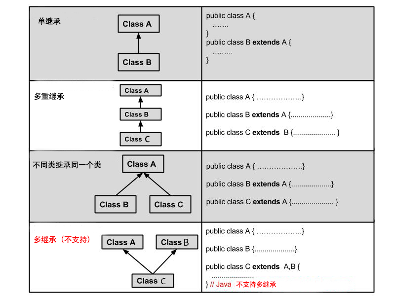

# 面向对象编程

## 对象和类

语句块→方法
变量集→结构体
方法+属性（变量集）→对象
对象的模板→类

类是一种抽象的数据类型，它是对某一类事物整体的描述/定义，但是并不能代表某一个具体事物。对象的模板。

对象是抽象的概念的具体实例。

## 面向过程与面向对象

**面向过程**：分析出解决问题所需要的步骤，然后用函数把这些步骤一步一步实现，使用的时候一个一个依次调用就可以了。适合处理较简单的问题。

**面向对象**：一种以“对象”为中心的编程思想，把构成问题事务分解成各个对象，建立对象的目的不是为了完成一个步骤，而是为了描叙某个事物在整个解决问题的步骤中的行为。适合处理复杂问题，需要多人协作的问题。

对于描述复杂的问题，为了从宏观上把我、从整体上合理分析，我们需要使用面向对象的思路来分析整个系统。但是，具体到围观操作，仍然需要面向过程的思路去处理。

## 什么是面向对象

本质：以类的方式组织代码，以对象的方式组织（封装）数据。

抽象：提取特征

三大特性：

- 封装
- 继承
- 多态

## 创建与初始化对象

使用 `new` 关键字创建对象，在创建对象的过程中除了分配内存空间之外，还会给创建好的对象进行默认的初始化以及对类中构造器的调用。

## 构造器

类中的构造器也称为构造方法，是在进行创建对象的时候必须调用的。并且构造器有以下两个特点：

1. 必须和类的名字相同
2. 必须没有返回类型，也不能写 `void`

构造器语法

```java
修饰符 类名(参数列表){
    ...
    初始化
    ...
}
```

作用：

- `new` 关键字的本质是通过构造器创建对象
- 通过构造器初始化对象

如果不显示定义构造器的话，类的构造器是一个无参的空构造器。如果显示定义了一个构造器的话，显示定义的构造器会把默认的无参空构造器覆盖掉。这也是为什么显示定义了一个有参构造器的情况下，如果要通过无参构造器创建对象的话会报错。

## 面向对象三大特征

### 封装

在面向对象程式设计方法中，封装（英语：Encapsulation）是指一种将抽象性函式接口的实现细节部分包装、隐藏起来的方法。

封装可以被认为是一个保护屏障，防止该类的代码和数据被外部类定义的代码随机访问。

要访问该类的代码和数据，必须通过严格的接口控制。

封装最主要的功能在于我们能修改自己的实现代码，而不用修改那些调用我们代码的程序片段。

适当的封装可以让程式码更容易理解与维护，也加强了程式码的安全性。

#### 封装的优点

1. 良好的封装能够减少耦合。

2. 类内部的结构可以自由修改。

3. 可以对成员变量进行更精确的控制。

4. 隐藏信息，实现细节。

```java
public class Person{
    private String name;
    private int age;
​
    public int getAge(){
      return age;
    }
​
    public String getName(){
      return name;
    }
​
    public void setAge(int age){
      this.age = age;
    }
​
    public void setName(String name){
      this.name = name;
    }
}
```

### 继承

继承是类和类之间的一种关系，除此之外，类和类之间的关系还有依赖、组合、聚合等。

继承关系的两个类，一个为子类（派生类），一个为父类（基类）。子类继承父类，使用关键字`extends`来表示。

```java
class 父类 {

}

class 子类 extends 父类 {

}
```

子类和父类之间，某种意义上讲应该具有 `is a` 的关系。父类更通用，子类更具体，子类是父类的拓展。

Java 中所有类都直接或间接地继承 `Object` 类。

被`final`修饰的类无法被继承。

#### 继承类型

Java 不支持多继承，但支持多重继承。



#### 继承的特性

- 子类拥有父类非 private 的属性、方法。
- 子类可以拥有自己的属性和方法，即子类可以对父类进行扩展。
- 子类可以用自己的方式实现父类的方法。
- Java 的继承是单继承，但是可以多重继承，单继承就是一个子类只能继承一个父类，多重继承就是，例如 A 类继承 B 类，B 类继承 C 类，所以按照关系就是 C 类是 B 类的父类，B 类是 A 类的父类，这是 Java 继承区别于 C++ 继承的一个特性。
- 提高了类之间的耦合性（继承的缺点，耦合度高就会造成代码之间的联系越紧密，代码独立性越差）。

#### `super` 与 `this` 关键字

super关键字：我们可以通过super关键字来实现对父类成员的访问，用来引用当前对象的父类。

this关键字：指向自己的引用。

`super()`表示父类的构造方法。继承的子类构造器中会在构造器的第一句隐含地调用父类的无参调用`super()`。如果父类没有无参构造器，可以显示调用定义的有参父类构造器。

`this()`表示当前类的构造方法。

`super()` 和 `this()` 据需要放在构造器方法的第一行,所以 `super()` 和 `this()` 不能同时出现。因为 `this()` 必然会调用其它的构造函数，其它的构造函数必然也会有 `super()` 语句的存在，所以在同一个构造函数里面有相同的语句，就失去了语句的意义，编译器也不会通过。也不允许出现两个 `super()` 和两个 `this()`。

`this` 和 `super` 都指的是对象，所以，均不可以在 `static` 环境中使用。包括：`static变量`, `static方法`，`static语句块`。

#### 重写

[Java 多态：深入解析方法重写（Override） & 方法重载（Overload）](https://blog.csdn.net/carson_ho/article/details/81502540)

重写是子类对父类的允许访问的方法的实现过程进行重新编写, 返回值和形参都不能改变。即**外壳不变，核心重写**！

重写是对方法的重写，不能被重写的方法：

1. 构造方法
2. 不能继承、不具备访问权限的方法（如`private`）
3. 声明为`final`、`static`的方法（后者能被再次声明）

**作用**：重写的好处在于子类可以根据需要，定义特定于自己的行为。 也就是说子类能够根据需要实现父类的方法。

**修饰符**：重写方法的访问修饰符限制不能更严格。 `public` > `protected` > `default` > `private`

**异常**：重写方法不能抛出新的检查异常或者比被重写方法申明更加宽泛的异常。例如： 父类的一个方法申明了一个检查异常 IOException，但是在重写这个方法的时候不能抛出 Exception 异常，因为 Exception 是 IOException 的父类，只能抛出 IOException 的子类异常。

### 多态

先了解继承多态内存图<sup>[[5]](https://blog.csdn.net/u012892431/article/details/38523281),[[6]](https://blog.csdn.net/thinking_in_android/article/details/8888286)</sup>

条件：继承+重写+父类变量引用子类对象

普通成员
  变量:都参考左边，因为变量不存在重写，方法中调用变量采用就近原则。
  方法:编译参考左边，运行参考右边。
静态成员
  变量和方法:编译运行都参考左边;  因为静态与对象无关。成员加静态修饰的没加private，都可以被类直接调用，所以参考的都是左边。

注：左边代表引用类型，右边代表对象类型。

## instanceof

```java
Object instanceof Class
```

Object是对象的引用，Class是类名。

如果Object对象引用类型不是Class的子类，编译失败。

如果Object所引用的对象类型是Class的子类对象，返回`true`，否则返回`false`。

## 类型转换

父类转子类：强制转换

```java
Person p = new Student();
Student s = (Student)p;

p = new Person();
s = (Student)p; // 不能够转换，因为没有创建Student对象实例
```

子类转父类：自动转换

```java
Student s = new Student();
Person p = s;
```

## 抽象类

在面向对象的概念中，所有的对象都是通过类来描绘的，但是反过来，并不是所有的类都是用来描绘对象的，如果一个类中没有包含足够的信息来描绘一个具体的对象，这样的类就是抽象类。

抽象类除了不能实例化对象之外，类的其它功能依然存在，成员变量、成员方法和构造方法的访问方式和普通类一样。

由于抽象类不能实例化对象，所以抽象类必须被继承，才能被使用。也是因为这个原因，通常在设计阶段决定要不要设计抽象类。

父类包含了子类集合的常见的方法，但是由于父类本身是抽象的，所以不能使用这些方法。

在抽象类中可以有构造方法，只是不能直接创建抽象类的实例对象，但实例化子类的时候，就会初始化父类，不管父类是不是抽象类都会调用父类的构造方法，初始化一个类，先初始化父类。

在Java中抽象类表示的是一种继承关系，一个类只能继承一个抽象类，而一个类却可以实现多个接口。

抽象类：单继承

接口：多继承

总结：

1. 抽象类不能被实例化(初学者很容易犯的错)，如果被实例化，就会报错，编译无法通过。只有抽象类的非抽象子类可以创建对象。

2. 抽象类中不一定包含抽象方法，但是有抽象方法的类必定是抽象类。

3. 抽象类中的抽象方法只是声明，不包含方法体，就是不给出方法的具体实现也就是方法的具体功能。

4. 构造方法，类方法（用 static 修饰的方法）不能声明为抽象方法。

5. 抽象类的子类必须给出抽象类中的抽象方法的具体实现，除非该子类也是抽象类。

### 接口

接口（英文：Interface），在Java编程语言中是一个抽象类型，是抽象方法的集合，接口通常以interface来声明。一个类通过继承接口的方式，从而来继承接口的抽象方法。

接口并不是类，编写接口的方式和类很相似，但是它们属于不同的概念。类描述对象的属性和方法。接口则包含类要实现的方法。

除非实现接口的类是抽象类，否则该类要定义接口中的所有方法。

接口无法被实例化，但是可以被实现。一个实现接口的类，必须实现接口内所描述的所有方法，否则就必须声明为抽象类。另外，在 Java 中，接口类型可用来声明一个变量，他们可以成为一个空指针，或是被绑定在一个以此接口实现的对象。

#### 接口特性

- 接口中每一个方法也是隐式抽象的,接口中的方法会被隐式的指定为 `public abstract`（只能是 `public abstract`，其他修饰符都会报错）。
- 接口中可以含有变量，但是接口中的变量会被隐式的指定为 `public static final` 变量（并且只能是 `public`，用 `private` 修饰会报编译错误）。
- 接口中的方法是不能在接口中实现的，只能由实现接口的类来实现接口中的方法。

#### 接口的声明

```java
[可见度] interface 接口名称 [extends 其他的接口名] {
        // 声明变量
        // 抽象方法
}
```

#### 接口的实现

当类实现接口的时候，类要实现接口中所有的方法。否则，类必须声明为抽象的类。

类使用implements关键字实现接口。在类声明中，Implements关键字放在class声明后面。

实现一个接口的语法，可以使用这个公式：

```java
接口的实现
```

#### 接口的继承

一个接口能继承另一个接口，和类之间的继承方式比较相似。接口的继承使用extends关键字，子接口继承父接口的方法。

在Java中，类的多继承是不合法，但接口允许多继承。

在接口的多继承中extends关键字只需要使用一次，在其后跟着继承接口。 如下所示：

```java
public interface Hockey extends Sports, Event
```

以上的程序片段是合法定义的子接口，与类不同的是，接口允许多继承，而 Sports及 Event 可能定义或是继承相同的方法

### 内部类

参考：

[Java内部类详解- Matrix海子- 博客园](https://www.cnblogs.com/dolphin0520/p/3811445.html)
[java提高篇(八)----详解内部类- chenssy - 博客园](https://www.cnblogs.com/chenssy/p/3388487.html)
[JAVA中内部类的继承和覆盖问题](https://blog.csdn.net/ECH00O00/article/details/76101131)

### 异常

参考：

[Java 异常处理 - 菜鸟教程](https://www.runoob.com/java/java-exceptions.html)

## 参考文献

1. [面向对象(oop)与面向过程(opp)的区别](https://blog.csdn.net/Edward_Wong/article/details/39533245#:~:text=%E9%9D%A2%E5%90%91%E8%BF%87%E7%A8%8B%E5%B0%B1%E6%98%AF%E5%88%86%E6%9E%90%E5%87%BA,%E7%9A%84%E6%AD%A5%E9%AA%A4%E4%B8%AD%E7%9A%84%E8%A1%8C%E4%B8%BA%E3%80%82)
2. [Java有参构造方法和无参构造方法](https://www.jianshu.com/p/cf5ad29676da)
3. [Java 封装 -  菜鸟教程](https://www.runoob.com/java/java-encapsulation.html)
4. [Java中this和super的用法总结](https://www.cnblogs.com/hasse/p/5023392.html)
5. [java基础之【继承--->多态】内存图](https://blog.csdn.net/u012892431/article/details/38523281)
6. [图解Java多态内存分配以及多态中成员方法的特点](https://blog.csdn.net/thinking_in_android/article/details/8888286)
7. [Java 抽象类 - 菜鸟教程](https://www.runoob.com/java/java-abstraction.html)
8. [Java 接口 - 菜鸟教程](https://www.runoob.com/java/java-interfaces.html)
9. [Java内部类详解- Matrix海子- 博客园](https://www.cnblogs.com/dolphin0520/p/3811445.html)
