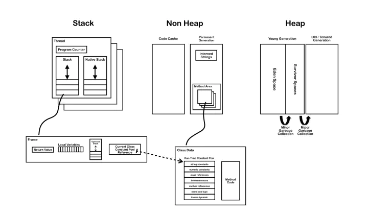

# 常量池

在JDK1.7之前运行时常量池逻辑包含字符串常量池存放在方法区, 此时hotspot虚拟机对方法区的实现为永久代

在JDK1.7 字符串常量池被从方法区拿到了堆中, 这里没有提到运行时常量池,也就是说字符串常量池被单独拿到堆,运行时常量池剩下的东西还在方法区, 也就是hotspot中的永久代

在JDK1.8 hotspot移除了永久代用元空间(Metaspace)取而代之, 这时候字符串常量池还在堆, 运行时常量池还在方法区, 只不过方法区的实现从永久代变成了元空间(Metaspace) 

## Class文件常量池

`.class`文件是一组以8位字节为单位的二进制数据流。在Java代码的编译期间，我们编写的`.java`文件就被编译为`.class`文件格式的二进制数据存放在磁盘中。`.class`文件中除了包含类的版本、字段、方法、接口等描述信息外，还有一项信息就是常量池(constant pool table)，用于存放编译器生成的各种字面量(Literal)和符号引用(Symbolic References)。

```java
class JavaBean {
    private int value = 1;
    public String s = "abc";
    public final static int f = 0x101;

    public void setValue(int v) {
        final int temp = 3;
        this.value = temp + v;
    }

    public int getValue() {
        return value;
    }
}
```

```bash
$ javac JavaBean.java

$ javap -v JavaBean
Classfile /C:/Users/Zerxoi/Java/src/JavaBean.class
  Last modified 2020年7月29日; size 460 bytes
  MD5 checksum 3c03da85cb661c6a550a94cab493a31c
  Compiled from "JavaBean.java"
class JavaBean
  minor version: 0
  major version: 55
  flags: (0x0020) ACC_SUPER
  this_class: #5                          // JavaBean
  super_class: #6                         // java/lang/Object
  interfaces: 0, fields: 3, methods: 3, attributes: 1
Constant pool:
   #1 = Methodref          #6.#24         // java/lang/Object."<init>":()V
   #2 = Fieldref           #5.#25         // JavaBean.value:I
   #3 = String             #26            // abc
   #4 = Fieldref           #5.#27         // JavaBean.s:Ljava/lang/String;
   #5 = Class              #28            // JavaBean
   #6 = Class              #29            // java/lang/Object
   #7 = Utf8               value
   #8 = Utf8               I
   #9 = Utf8               s
  #10 = Utf8               Ljava/lang/String;
  #11 = Utf8               f
  #12 = Utf8               ConstantValue
  #13 = Integer            257
  #14 = Utf8               <init>
  #15 = Utf8               ()V
  #16 = Utf8               Code
  #17 = Utf8               LineNumberTable
  #18 = Utf8               setValue
  #19 = Utf8               (I)V
  #20 = Utf8               getValue
  #21 = Utf8               ()I
  #22 = Utf8               SourceFile
  #23 = Utf8               JavaBean.java
  #24 = NameAndType        #14:#15        // "<init>":()V
  #25 = NameAndType        #7:#8          // value:I
  #26 = Utf8               abc
  #27 = NameAndType        #9:#10         // s:Ljava/lang/String;
  #28 = Utf8               JavaBean
  #29 = Utf8               java/lang/Object
{
  public java.lang.String s;
    descriptor: Ljava/lang/String;
    flags: (0x0001) ACC_PUBLIC

  public static final int f;
    descriptor: I
    flags: (0x0019) ACC_PUBLIC, ACC_STATIC, ACC_FINAL
    ConstantValue: int 257

  JavaBean();
    descriptor: ()V
    flags: (0x0000)
    Code:
      stack=2, locals=1, args_size=1
         0: aload_0
         1: invokespecial #1                  // Method java/lang/Object."<init>":()V
         4: aload_0
         5: iconst_1
         6: putfield      #2                  // Field value:I
         9: aload_0
        10: ldc           #3                  // String abc
        12: putfield      #4                  // Field s:Ljava/lang/String;
        15: return
      LineNumberTable:
        line 1: 0
        line 2: 4
        line 3: 9

  public void setValue(int);
    descriptor: (I)V
    flags: (0x0001) ACC_PUBLIC
    Code:
      stack=3, locals=3, args_size=2
         0: aload_0
         1: iconst_3
         2: iload_1
         3: iadd
         4: putfield      #2                  // Field value:I
         7: return
      LineNumberTable:
        line 8: 0
        line 9: 7

  public int getValue();
    descriptor: ()I
    flags: (0x0001) ACC_PUBLIC
    Code:
      stack=1, locals=1, args_size=1
         0: aload_0
         1: getfield      #2                  // Field value:I
         4: ireturn
      LineNumberTable:
        line 12: 0
}
SourceFile: "JavaBean.java
```

可以看到这个命令之后我们得到了该class文件的版本号、常量池、已经编译后的字节码指令。

### 字面量

字面量接近于java语言层面的常量概念，主要包括：

- 文本字符串，也就是我们经常声明的：`public String s = "abc";`中的`"abc"`。
- 用`final`修饰的成员变量，包括静态变量、实例变量和局部变量。

### 符号引用

符号引用主要设涉及编译原理方面的概念，包括下面三类常量:

- 类和接口的全限定名
- 字段的名称和描述符
- 方法的名称和描述符

## 运行时常量池

运行时常量池在JDK1.6及之前版本的JVM中是方法区的一部分，而在HotSpot虚拟机中方法区放在了”永久代(Permanent Generation)”。所以运行时常量池也是在永久代的。
但是JDK1.7及之后版本的JVM已经将运行时常量池从方法区中移了出来，在Java 堆（Heap）中开辟了一块区域存放运行时常量池。

运行时常量池是方法区的一部分，所以也是全局共享的。我们知道，jvm在执行某个类的时候，必须经过加载、连接(验证,准备,解析)、初始化，在第一步的加载阶段，虚拟机需要完成下面3件事情：

- 通过一个类的“全限定名”来获取此类的二进制字节流
- 将这个字节流所代表的静态储存结构转化为方法区的运行时数据结构
- 在内存中生成一个类代表这类的java.lang.Class对象，作为方法区这个类的各种数据访问的入口

这里需要说明的一点是，类对象和普通的实例对象是不同的，类对象是在类加载的时候生成的，普通的实例对象一般是在调用new之后创建。

上面第二条，将class字节流代表的静态储存结构转化为方法区的运行时数据结构，其中就包含了class文件常量池进入运行时常量池的过程。这里需要强调一下，不同的类共用一个运行时常量池<sup>[1](http://blog.csdn.net/fan2012huan/article/details/52759614)</sup>，同时在进入运行时常量池的过程中，多个class文件中常量池中相同的字符串只会存在一份在运行时常量池中，这也是一种优化。

运行时常量池的作用是存储 Java class文件常量池中的符号信息。运行时常量池 中保存着一些 class 文件中描述的符号引用，同时在类加载的“解析阶段”还会将这些符号引用所翻译出来的直接引用(直接指向实例对象的指针)存储在 运行时常量池 中。

运行时常量池相对于 class 常量池一大特征就是其具有动态性，Java 规范并不要求常量只能在运行时才产生，也就是说运行时常量池中的内容并不全部来自 class 常量池，class 常量池并非运行时常量池的唯一数据输入口；在运行时可以通过代码生成常量并将其放入运行时常量池中，这种特性被用的较多的是String.intern()（这个方法下面将会详细讲）。

## 全局字符串常量池

字符串常量池（String Pool）和运行时常量池不是一个概念。



在JDK 1.6中，方法区实际上是在一块叫“非堆”的区域包含——可以简单粗略的理解为非堆中包含了永生代，而永生代中又包含了方法区和字符串常量池。JDK 1.7中，字符串常量池和类引用被移动到了Java堆中(与运行时常量池分离)，因此不同版本的String行为也有所差异。

JDK 1.7中，在代码中申明String s1 = "Hello";这句代码后，在类加载的过程中，类的class文件的信息会被解析到内存的方法区里。

class文件里常量池里大部分数据会被加载到“运行时常量池”，包括String的字面量；但同时“Hello”字符串的一个引用会被存到同样在“字符串常量池”中，而"Hello"本体还是和所有对象一样，创建在Java堆中。

当主线程开始创建s1时，虚拟机会先去字符串池中找是否有equals(“Hello”)的String，如果相等就把在字符串池中“Hello”的引用复制给s1；如果找不到相等的字符串，就会在堆中新建一个对象，同时把引用驻留在字符串池，再把引用赋给str。

当用字面量赋值的方法创建字符串时，无论创建多少次，只要字符串的值相同，它们所指向的都是堆中的同一个对象。

## 字符串常量创建过程整理

JVM加载类的时候会把Class常量池的类型CONSTANT_Utf8_info，CONSTANT_String_info加载到运行时常量池，此时，全局常量池为空并且没有创建任何字符串对象。CONSTANT_Utf8会在类加载的过程中就全部创建出来，而CONSTANT_String则是lazy resolve的，在第一次引用该项的ldc指令被第一次执行到的时候才会resolve。在尚未resolve的时候，HotSpot VM把它的类型叫做JVM_CONSTANT_UnresolvedString，内容跟Class文件里一样只是一个index；等到resolve过后这个项的常量类型就会变成最终的JVM_CONSTANT_String。在当执行ldc字节码的时候，JVM会到运行时常量池查找CONSTANT_String_info的index对应项，如果不是指向对象则resolve。在resolve阶段会在全局字符串常量池中添加字符串的引用。

在遇到String类型常量时，resolve的过程如果发现StringTable已经有了内容匹配的java.lang.String的引用，则直接返回这个引用，反之，如果StringTable里尚未有内容匹配的String实例的引用，则会在Java堆里创建一个对应内容的String对象，然后在StringTable记录下这个引用，并返回这个引用出去。

## String.intern() 方法

在 JDK6 下，intern()会把首次遇到的字符串实例复制到永久代中，返回的也是这个永久代中字符串实例的引用；而在JDK1.7开始，intern()方法不在复制字符串实例，String 的 intern 方法首先将尝试在常量池中查找该对象的引用，如果找到则直接返回该对象在常量池中的引用地址，如果找不到就把该对象的引用存在字符串常量池中。

## 参考文献

1. [《Java虚拟机原理图解》 1.2.2、Class文件中的常量池详解（上）](https://blog.csdn.net/u010349169/article/details/39960815)
2. [《Java虚拟机原理图解》 1.2.3、Class文件中的常量池详解（下）](https://blog.csdn.net/u010349169/article/details/40301985)
3. [JVM常量池浅析](https://www.jianshu.com/p/cf78e68e3a99)
4. [Java 中new String("字面量") 中 "字面量" 是何时进入字符串常量池的? - 木女孩的回答](https://www.zhihu.com/question/55994121/answer/147296098)
5. [请别再拿“String s = new String("xyz");创建了多少个String实例”来面试了吧](https://www.iteye.com/blog/rednaxelafx-774673)
6. [JDK1.8关于运行时常量池, 字符串常量池的要点](https://blog.csdn.net/q5706503/article/details/84640762)
7. [方法区和常量池](https://blog.csdn.net/wangbiao007/article/details/78545189)
8. [字符串常量池和运行时常量池是在堆还是在方法区？](https://www.cnblogs.com/cosmos-wong/p/12925299.html)
9. [从字符串到常量池，一文看懂String类设计](https://zhuanlan.zhihu.com/p/149055800)
10. [JVM 常量池中存储的是对象还是引用呢？ - RednaxelaFX的回答](https://www.zhihu.com/question/57109429/answer/151717241)