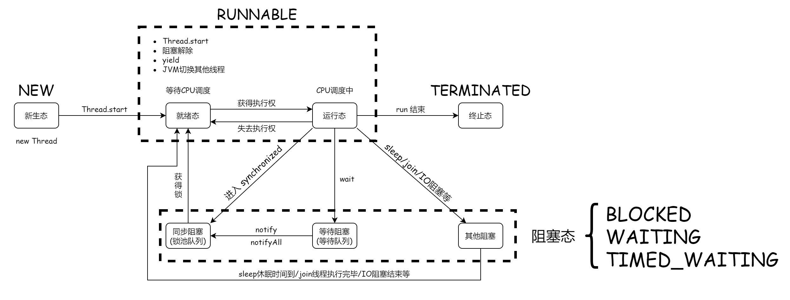

## 1 线程的实现

|特性\实现|继承 `Thread` 类|实现 `Runnable` 接口|实现 `Callable` 接口|
|------|----------------|--------------------|------------------|
|公用|否|是|是|
|返回值|否|否|是|
|异常|`run()` 中 `try-catch`|`run()` 中 `try-catch`|异常抛出|


### 1.1 继承 Thread 类

```java
public class ThreadDemo extends Thread {
    @Override
    public void run() {
        for (int i = 0; i < 100; i++) {
            System.out.println("线程----" + i);
        }
    }

    public static void main(String[] args) {
        new ThreadDemo().start();

        for (int i = 0; i < 100; i++) {
            System.out.println("main-----"+i);
        }
    }
}
```

### 1.2 实现 Runnable 接口

```java
public class RunnableDemo implements Runnable {
    @Override
    public void run() {
        for (int i = 0; i < 100; i++) {
            System.out.println(Thread.currentThread().getName() + "----------" + i);
        }
    }

    public static void main(String[] args) {
        RunnableDemo rt = new RunnableDemo();
        new Thread(rt, "ThreadA").start();
        new Thread(rt, "ThreadB").start();

        for (int i = 0; i < 100; i++) {
            System.out.println(Thread.currentThread().getName() + "----------" + i);
        }
    }
}
```

### 1.3 实现 Callable 接口

```java
import java.util.concurrent.Callable;
import java.util.concurrent.ExecutorService;
import java.util.concurrent.Executors;
import java.util.concurrent.Future;
import java.util.concurrent.FutureTask;

public class CallableDemo implements Callable<Long> {
    int n;

    public CallableDemo(int n) {
        this.n = n;
    }

    @Override
    public Long call() {
        return nthFibonacci(n);
    }

    public static void main(String[] args) {
        CallableDemo d1 = new CallableDemo(10);
        CallableDemo d2 = new CallableDemo(15);
        CallableDemo d3 = new CallableDemo(20);
        CallableDemo d4 = new CallableDemo(25);
        CallableDemo d5 = new CallableDemo(25);

        ExecutorService ser = Executors.newFixedThreadPool(5);

        Future<Long> tr1 = ser.submit(d1);
        Future<Long> tr2 = ser.submit(d2);
        Future<Long> tr3 = ser.submit(d3);
        Future<Long> tr4 = ser.submit(d4);

        FutureTask<Long> ft = new FutureTask<Long>(d5);
        new Thread(ft).start();

        try {
            System.out.println("10 th Fibonacci :" + tr1.get());
            System.out.println("15 th Fibonacci :" + tr2.get());
            System.out.println("20 th Fibonacci :" + tr3.get());
            System.out.println("25 th Fibonacci :" + tr4.get());
            System.out.println("25 th Fibonacci :" + ft.get());
        } catch (Exception e) {
            e.printStackTrace();
        }

        ser.shutdownNow();
    }

    public long nthFibonacci(int n) {
        if (n == 0 || n == 1) {
            return n;
        }
        long a = 0, b = 1;
        long tmp;
        for (int i = 2; i <= n; i++) {
            tmp = a + b;
            a = b;
            b = tmp;
        }
        return b;
    }
}
```

## 2 线程的分类

[JAVA用户线程&守护线程的区别](https://blog.csdn.net/dream_broken/article/details/8913563)

- 用户线程
- 守护线程

可以通过 setDaemon 方法将用户线程设置为守护线程。

```java
public final void setDaemon(boolean on) {
    checkAccess();
    if (isAlive()) {
        throw new IllegalThreadStateException();
    }
    daemon = on;
}
```

注：如果要把一个线程设置为守护线程，则必须在它启动前，调用该方法进行设置。

```java
public class DaemonDemo {
    public static void main(String[] args) {
        Runnable god = () -> {
            while (true) {
                try {
                    Thread.sleep(1);
                } catch (InterruptedException e) {
                    e.printStackTrace();
                }
                System.out.println("God bless you.");
            }
        };

        Runnable people = () -> {
            for (int i = 1; i <= 100; i++) {
                System.out.println("I have lived for " + i + " years");
            }
            System.out.println("Goodbye world");
        };

        Thread godThread = new Thread(god);
        godThread.setDaemon(true);

        Thread peopleThread = new Thread(people);
        godThread.start();
        peopleThread.start();
    }
}
```

## 3 Lambda 表达式的演变

```java
// Functional interface（函数式接口）可以通过lambda表达式创建该接口对象
public class LambdaExpressionDemo {
    // 3.静态内部类
    static class Like2 implements ILike {
        @Override
        public void lambda() {
            System.out.println("I like lambda2");
        }
    }

    public static void main(String[] args) {
        ILike like = new Like();
        like.lambda();

        like = new Like2();
        like.lambda();

        // 4.局部内部类
        class Like3 implements ILike {
            @Override
            public void lambda() {
                System.out.println("I like lambda3");
            }
        }

        like = new Like3();
        like.lambda();

        // 5.匿名内部类
        like = new ILike(){
            @Override
            public void lambda() {
                System.out.println("I like lambda4");
            }
        };
        like.lambda();

        // 6.lambda表达式
        like = () -> {
            System.out.println("I like lambda5");
        };
        like.lambda();
    }
}

// 1.定义一个函数式接口
interface ILike {
    void lambda();
}

// 2.实现类
class Like implements ILike {
    @Override
    public void lambda() {
        System.out.println("I like lambda");
    }
}
```

## 4 线程状态

[Java线程的5种状态及切换(透彻讲解)-京东面试](https://www.cnblogs.com/aspirant/p/8900276.html)

[BLOCKED,WAITING,TIMED_WAITING有什么区别？-用生活的例子解释](https://segmentfault.com/a/1190000010973341)



任意一个对象以及其子类对象都有两个队列

- 同步队列(锁池队列): 所有尝试获取该对象Monitor失败的线程, 都加入同步队列争抢对象锁
- 等待队列: 已经拿到锁的线程在等待其他资源时调用 `wait` 主动释放锁，置入该对象等待队列中，等待被唤醒. 当调用 `notify()` 会在等待队列中任意唤醒一个线程，将其置入同步队列排队获取锁; 当调用 `notifyAll()` 会唤醒等待队列中的所有线程, 将其置入同步队列争抢对象锁.

```java
public enum State {
    /**
     * Thread state for a thread which has not yet started.
     */
    NEW,

    /**
     * Thread state for a runnable thread.  A thread in the runnable
     * state is executing in the Java virtual machine but it may
     * be waiting for other resources from the operating system
     * such as processor.
     */
    RUNNABLE,

    /**
     * Thread state for a thread blocked waiting for a monitor lock.
     * A thread in the blocked state is waiting for a monitor lock
     * to enter a synchronized block/method or
     * reenter a synchronized block/method after calling
     * {@link Object#wait() Object.wait}.
     */
    BLOCKED,

    /**
     * Thread state for a waiting thread.
     * A thread is in the waiting state due to calling one of the
     * following methods:
     * <ul>
     *   <li>{@link Object#wait() Object.wait} with no timeout</li>
     *   <li>{@link #join() Thread.join} with no timeout</li>
     *   <li>{@link LockSupport#park() LockSupport.park}</li>
     * </ul>
     *
     * <p>A thread in the waiting state is waiting for another thread to
     * perform a particular action.
     *
     * For example, a thread that has called {@code Object.wait()}
     * on an object is waiting for another thread to call
     * {@code Object.notify()} or {@code Object.notifyAll()} on
     * that object. A thread that has called {@code Thread.join()}
     * is waiting for a specified thread to terminate.
     */
    WAITING,

    /**
     * Thread state for a waiting thread with a specified waiting time.
     * A thread is in the timed waiting state due to calling one of
     * the following methods with a specified positive waiting time:
     * <ul>
     *   <li>{@link #sleep Thread.sleep}</li>
     *   <li>{@link Object#wait(long) Object.wait} with timeout</li>
     *   <li>{@link #join(long) Thread.join} with timeout</li>
     *   <li>{@link LockSupport#parkNanos LockSupport.parkNanos}</li>
     *   <li>{@link LockSupport#parkUntil LockSupport.parkUntil}</li>
     * </ul>
     */
    TIMED_WAITING,

    /**
     * Thread state for a terminated thread.
     * The thread has completed execution.
     */
    TERMINATED;
}
```

`BLOCKED`: 线程在锁池队列中等待进入 `synchronized` 方法/代码块的线程状态

`WAITING`: 线程等待其他线程完成特定操作的状态

|触发方法|解除方法|
|--------|-------|
|`thread.join()`|`thread` 进程运行结束|
|`Object.wait()`|`Object.notify()`/`Object.notifyAll()`|
|`LockSupport.park()`|`LockSupport.unpark(Thread)`|

`TIMED_WAITING`: 具有指定等待时间的等待线程的线程状态

|触发方法|解除方法|
|--------|-------|
|`Thread.sleep(long)`|休眠结束|
|`thread.join(long)`|时间截止或`thread` 进程运行结束|
|`Object.wait(long)`|`Object.notify()`/`Object.notifyAll()`|
|`LockSupport.parkNanos`/`LockSupport.parkUntil`|`LockSupport.unpark(Thread)`|

## 5 线程方法

[sleep、yield、wait、join的区别(阿里)](https://www.cnblogs.com/aspirant/p/8876670.html)

### 5.1 sleep

**线程休眠: 当前线程休眠进入阻塞态(释放CPU, 不释放锁)**

当前线程休眠, `Thread` 类的(静态)方法, 必须带一个时间参数. 会让当前线程休眠进入阻塞状态并释放CPU(`sleep` 释放CPU，`wait` 也会释放CPU，因为CPU资源太宝贵了，只有在线程运行态的时候，才会获取CPU片段), 提供其他线程运行的机会且不考虑优先级, 但如果有同步锁则 `sleep` 不会释放锁即其他线程无法获得同步锁. 可通过调用 `interrupt()` 方法来唤醒休眠线程并抛出 `InterruptedException` 异常.

### 5.2 yield

**线程礼让: 当前线程从运行态转至就绪态,让CPU重新调度(释放CPU, 不释放锁)**

让出CPU调度，`Thread` 类的(静态)方法, 类似 `sleep` 只是不能由用户指定暂停多长时间, 并且 `yield()` 方法只能让同优先级的线程有执行的机会. `yield()` 只是使当前线程重新回到就绪状态，所以执行 `yield()` 的线程有可能在进入到可执行状态后马上又被执行。调用 `yield()` 方法只是一个建议, 告诉线程调度器我的工作已经做的差不多了, 可以让别的相同优先级的线程使用CPU了, 没有任何机制保证采纳.

### 5.3 为什么是 sleep 和 yield 是静态方法

[JAVA系列：为什么Thread类的sleep()和yield()方法是静态的?](https://blog.csdn.net/VIP099/article/details/108422625)

`Thread` 类的 `sleep` 和 `yield` 方法将在当前正在执行的线程上运行. 所以在其他处于等待状态的线程上调用这些方法是没有意义的, 这就是为什么这些方法是静态的. 它们可以在当前正在执行的线程中工作, 并避免程序员错误的认为可以在其他非运行线程调用这些方法.

### 5.4 wait 和 notify/notifyAll

`wait` 和 `notify`/`notifyAll` 都是成员方法


`obj.wait` 方法执行前, 线程必先获取 `obj` 对象锁(`synchronized`方法或者`synchronized`块), 在执行 `obj.wait` 方法时, 线程会释放 `obj` 对象锁, 将当前线程放入 `obj` 对象等待队列, 等待被 `obj.notify` 或者 `obj.notifyAll` 方法唤醒.

`obj.notify` 和 `obj.notifyAll` 方法执行前, 线程也必须先获得 `obj` 对象锁, 在执行时会将 `obj` 对象锁释放, `obj.notify` 会从 `obj` 对象的等待队列中唤醒任意一个线程, 将其转移至 `obj` 对象的同步队列竞争 `obj` 对象锁; `obj.notifyAll` 则是将 `obj` 对象等待队列中的全部的线程唤醒, 并移至 `obj` 对象的同步队列竞争 `obj` 对象锁.

```java
public class WaitNotifyDemo {
    public static void main(String[] args) {
        SynObj synObj = new SynObj();
        ARunnable r = new ARunnable(synObj);
        new Thread(r).start();
        new Thread(r).start();

        try {
            Thread.sleep(100);
        } catch (InterruptedException e) {
            e.printStackTrace();
        }

        // 从synObj对象等待队列唤醒一个进程
        synchronized (synObj) {
            System.out.println(Thread.currentThread().getName() + " 获得 synObj 对象锁");
            System.out.println(Thread.currentThread().getName() + " 释放 synObj 对象锁");
            System.out.println(Thread.currentThread().getName() + " 移动至 synObj 对象同步队列");
            synObj.notify();
        }

        try {
            Thread.sleep(100);
        } catch (InterruptedException e) {
            e.printStackTrace();
        }

        // 从synObj对象等待队列唤醒一个进程
        synchronized (synObj) {
            System.out.println(Thread.currentThread().getName() + " 获得 synObj 对象锁");
            System.out.println(Thread.currentThread().getName() + " 释放 synObj 对象锁");
            System.out.println(Thread.currentThread().getName() + " 移动至 synObj 对象同步队列");
            synObj.notify();
        }
    }
}

class ARunnable implements Runnable {
    SynObj synObj;

    public ARunnable(SynObj synObj) {
        this.synObj = synObj;
    }

    @Override
    public void run() {
        f();
    }

    synchronized public void f() {
        System.out.println(Thread.currentThread().getName() + " 获得 r 对象锁");
        synObj.syn();
        System.out.println(Thread.currentThread().getName() + " 释放 r 对象锁");
    }
}

class SynObj {
    synchronized public void syn() {
        System.out.println(Thread.currentThread().getName() + " 获得 synObj 对象锁");
        try {
            System.out.println(Thread.currentThread().getName() + " 释放 synObj 对象锁");
            System.out.println(Thread.currentThread().getName() + " 移动至 synObj 对象等待队列");
            wait();
        } catch (InterruptedException e) {
            e.printStackTrace();
        }
        System.out.println(Thread.currentThread().getName() + " 被唤醒");
        System.out.println(Thread.currentThread().getName() + " 继续执行");
    }
}
```

运行结果

```
Thread-0 获得 r 对象锁
Thread-0 获得 synObj 对象锁
Thread-0 释放 synObj 对象锁
Thread-0 移动至等待队列
main 获得 synObj 对象锁
main 释放 synObj 对象锁
main 移动至同步队列
Thread-0 被唤醒
Thread-0 继续执行
Thread-0 释放 r 对象锁
Thread-1 获得 r 对象锁
Thread-1 获得 synObj 对象锁
Thread-1 释放 synObj 对象锁
Thread-1 移动至等待队列
main 获得 synObj 对象锁
main 释放 synObj 对象锁
main 移动至同步队列
Thread-1 被唤醒
Thread-1 继续执行
Thread-1 释放 r 对象锁
```

### 5.5 join

[【Java】Thread类中的join()方法原理](https://blog.csdn.net/u010983881/article/details/80257703)

[Thread.join()原理](https://focusss.github.io/2019/02/27/Thread-join-%E5%8E%9F%E7%90%86/)

`join` 方法是成员方法

```java
public class JoinThreadDemo implements Runnable {
    @Override
    public void run() {
        for (int i = 0; i < 500; i++) {
            System.out.println("VIP"+i);
        }
    }

    public static void main(String[] args) throws InterruptedException {
        Thread thread = new Thread(new JoinThreadDemo());
        thread.start();

        for (int i = 0; i < 500; i++) {
            System.out.println("main"+i);
            if (i == 200) {
                thread.join();
            }
        }
    }
}
```

`join` 源码如下

```java
public final void join() throws InterruptedException {
    join(0);
}

public final synchronized void join(long millis)
throws InterruptedException {
    long base = System.currentTimeMillis();
    long now = 0;

    if (millis < 0) {
        throw new IllegalArgumentException("timeout value is negative");
    }

    if (millis == 0) {
        while (isAlive()) {
            wait(0);
        }
    } else {
        while (isAlive()) {
            long delay = millis - now;
            if (delay <= 0) {
                break;
            }
            wait(delay);
            now = System.currentTimeMillis() - base;
        }
    }
}
```

`thread.join()` 调用时, 因为 `join`是个 `synchronized` 方法, 因此主线程会持有 `thread` 对象锁, `isAlive` 方法是由 `thread` 对象调用的用来查看 `thread` 对象是否运行完成(即进入终止态). 如果运行结束则直接退出方法; 否则主线程执行 `thread.wait` 方法, 主线程释放 `thread` 对象锁, 同时主线程被移动至 `thread` 对象的等待队列.

在 `thread` 进程执行结束后, JVM会调用 `lock.notify_all(thread);` (JVM源码`/hotspot/src/share/vm/runtime/thread.cpp`)唤醒 `thread` 对象等待队列的所有线程. 在本例中主线程被唤醒并继续执行.

### 5.6 中断

```java
// 中断状态:
//      线程被中断: true
//      线程未中断: fasle

// 测试线程是否被中断. ClearInterrupted 参数控制是否清空中断状态.
@HotSpotIntrinsicCandidate
private native boolean isInterrupted(boolean ClearInterrupted);

// 成员方法: 测试线程对象是否被中断, 该方法不会改变线程中断状态.
// 线程终止时调用该方法将返回 false.
public boolean isInterrupted() {
    return isInterrupted(false);
}

// 静态方法: 测试当前线程是否被中断, 该方法会清空当前线程的中断状态.
// 线程终止时调用该方法将返回 false.
public static boolean interrupted() {
    return currentThread().isInterrupted(true);
}

// 成员方法: 中断线程对象
// 线程中断自己是总是被许可的, 其他情况下, 会调用这个线程的checkAccess方法, 这可能会导致一个SecurityException被抛出.
// 如果线程阻塞在 Object.wait, Thread.join, Thread.sleep 方法的调用, 它的中断状态将会被清空, 该线程将收到 InterruptedException 异常.
// 如果这个线程在I/O操作中被阻塞在一个 java.nio.channels.InterruptibleChannel 上, 那么该通道将被关闭, 线程的中断状态将被设置, 线程将收到一个ClosedByInterruptException.
// 如果这个线程在 java.nio.channels.Selector 中被阻塞, 那么该线程的中断状态将被设置, 并且它将立即从选择操作中返回, 可能返回一个非零的值, 就像调用了Selector的wakeup方法一样。
// 如果前面的条件都不成立, 那么这个线程的中断状态将被设置.
// 中断一个终止的线程没有有任何反应.
public void interrupt() {
    if (this != Thread.currentThread()) {
        checkAccess();

        // thread may be blocked in an I/O operation
        synchronized (blockerLock) {
            Interruptible b = blocker;
            if (b != null) {
                interrupt0();  // set interrupt status
                b.interrupt(this);
                return;
            }
        }
    }

    // set interrupt status
    interrupt0();
}
```

### 5.7 线程终止

[Java结束线程的三种方法](https://blog.csdn.net/xu__cg/article/details/52831127)

#### 5.7.1 stop 为何被废弃

[java thread的stop，suspend，resume等方法废弃的原因](https://blog.csdn.net/gediseer/article/details/53835295)

调用 `stop()` 方法是不安全的, `thread.stop()` 调用之后, 创建子线程的线程就会抛出 `ThreadDeath` 的错误, 并且会释放子线程所持有的所有锁. 一般任何进行加锁的代码块，都是为了保护数据的一致性，如果在调用`thread.stop()` 后导致了该线程所持有的所有锁的突然释放(不可控制), 那么被保护数据就有可能呈现不一致性, 其他线程在使用这些被破坏的数据时, 有可能导致一些很奇怪的应用程序错误. 因此, 并不推荐使用stop方法来终止线程.

#### 5.7.2 退出标志

```java
public class StopThreadDemo implements Runnable {
    private boolean flag = true;

    @Override
    public void run() {
        int i = 0;
        while (flag) {
            System.out.println("run...Thread" + i++);
        }
    }

    public void stop() {
        flag = false;
    }

    public static void main(String[] args) {
        StopThreadDemo demo = new StopThreadDemo();
        new Thread(demo).start();
        for (int i = 0; i < 100; i++) {
            System.out.println("main"+i);
            if (i == 50){
                demo.stop();
                System.out.println("线程停止");
            }
        }
    }
}
```

#### 5.7.3 interrupt() 方法中断

```java
public class InteruptDemo extends Thread {
    @Override
    public void run() {
        // 判断是否被中断, 如果中断退出循环, 结束线程
        while (!interrupted()) {
            System.out.println("线程开始");
            try {
                System.out.println("线程阻塞");
                Thread.sleep(10000);
            } catch (InterruptedException e) {
                e.printStackTrace();
                System.out.println("线程中断");
                // break 跳出循环, 结束线程
                break;
            }
            System.out.println("线程结束");
        }
    }

    public static void main(String[] args) {
        InteruptDemo t = new InteruptDemo();
        t.start();
        try {
            Thread.sleep(100);
        } catch (InterruptedException e) {
            e.printStackTrace();
        }

        // 线程中断
        t.interrupt();
        System.out.println("主线程继续执行");
    }
}
```

## 6 线程同步

`线程的并发性`: 两个线程或多个线程在同一时间间隔内执行. 这些线程宏观上是同时执行的, 但微观上确实交替执行的.
`线程的异步性`: 多个线程并发执行时, 由于资源有限, 线程的执行不是一贯到底的, 而是走走停停的, 已不可预知的速度向前推进.

在多线程程序中, 由于线程的并发性导致了线程的异步性, 线程之间以不可预知的速度向前推进, 但是由于资源有限, 线程之间往往需要以特定的顺序执行, 因此就需要线程同步机制来协调线程之间的工作次序.

### 管程

管程(monitor)是一种高级的同步机制, 本质上也适用于实现线程的互斥, 同步的, 比信号量机制更方便应用.

管程是一种特殊的软件模块, 拥有如下部分组成:
- 局部于管程的共享数据结构说明
- 对于数据结构进行操作的一组过程
- 对局部于管程的共享数据的设置初始化语句
- 管程有一个名字

过程的基本特征:
- 局部于管程的数据只能被局部于管程的过程所访问
- 一个进程只有通过调用管程内的过程才能进入管程访问共享数据
- 每次仅允许一个进程在管程内执行某个内部过程


[Java并发编程：同步容器](https://www.cnblogs.com/dolphin0520/p/3933404.html)
[Java并发——同步容器与并发容器](https://www.cnblogs.com/shijiaqi1066/p/3412275.html)

### 同步容器

### 并发容器

### 锁

不可重入锁:加锁的内容不允许其他线程执行, 但是本线程不能两次加锁.

```java
public class LockDemo {
    static Lock lock = new Lock();

    public static void main(String[] args) {
        try {
            a();
        } catch (InterruptedException e1) {
            e1.printStackTrace();
        }
        new Thread(() -> {
            try {
                a();
            } catch (InterruptedException e) {
                e.printStackTrace();
            }
        }).start();
    }

    public static void a() throws InterruptedException {
        lock.lock();
        System.out.println(Thread.currentThread().getName() + " lock");
        b();
        System.out.println(Thread.currentThread().getName() + " unlock");
        lock.unlock();
    }

    public static void b() throws InterruptedException {
        lock.lock();
        System.out.println(Thread.currentThread().getName() + " lock");
        Thread.sleep(1000);
        System.out.println(Thread.currentThread().getName() + " unlock");
        lock.unlock();
    }
}

class Lock {
    boolean locked;
    public synchronized void lock() throws InterruptedException {
        if (locked) // 如果已经上锁, 当前进程加入 lock 对象等待队列中
            wait();
        locked = true; // 上锁
    }

    public synchronized void unlock() {
        locked = false; // 解锁
        notify(); // 唤醒 lock 对象队列中的线程
    }
}
```

可重入锁:加锁内容不允许其他内容访问, 并且能够多次上锁.

```java
public class LockDemo {
    static Lock lock = new Lock();

    public static void main(String[] args) {
        try {
            a();
        } catch (InterruptedException e1) {
            e1.printStackTrace();
        }
        new Thread(() -> {
            try {
                a();
            } catch (InterruptedException e) {
                e.printStackTrace();
            }
        }).start();
    }

    public static void a() throws InterruptedException {
        lock.lock();
        System.out.println(Thread.currentThread().getName() + " lock");
        b();
        System.out.println(Thread.currentThread().getName() + " unlock");
        lock.unlock();
    }

    public static void b() throws InterruptedException {
        lock.lock();
        System.out.println(Thread.currentThread().getName() + " lock");
        Thread.sleep(1000);
        System.out.println(Thread.currentThread().getName() + " unlock");
        lock.unlock();
    }
}

class Lock {
    int count;
    Thread lockedby;
    public synchronized void lock() throws InterruptedException {
        Thread t = Thread.currentThread();
        if (count > 0 && lockedby != t)
            wait();
        count++;
        lockedby = t;
    }

    public synchronized void unlock() {
        Thread t = Thread.currentThread();
        if (lockedby == t) {
            count--;
            if (count == 0)
                notify();
        }
    }
}
```